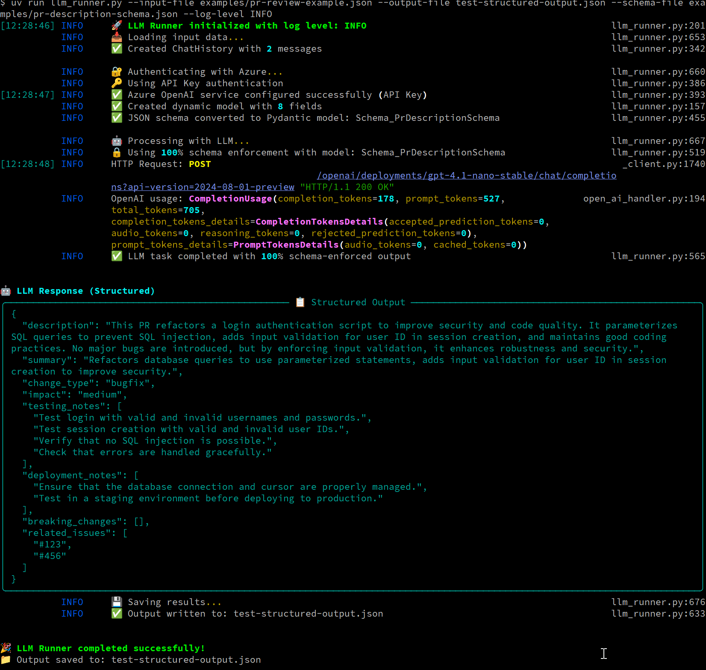

# AI-First DevOps Toolkit: LLM-Powered CI/CD Automation

> **🚀 The Future of DevOps is AI-First**  
> This toolkit represents a step toward [AI-First DevOps](https://technologyworkroom.blogspot.com/2025/06/building-ai-first-devops.html) - where intelligent automation handles the entire development lifecycle. Built for teams ready to embrace the exponential productivity gains of AI-powered development. Please read [the blog post](https://technologyworkroom.blogspot.com/2025/06/building-ai-first-devops.html) for more details on the motivation.

## TLDR: What This Tool Does

**Purpose**: Zero-friction LLM integration for CI/CD pipelines with **100% guaranteed schema compliance**. This is your foundation for AI-first development practices.

**Perfect For**:
- 🤖 **AI-Generated Code Reviews**: Automated PR analysis with structured findings
- 📝 **Intelligent Documentation**: Generate changelogs, release notes, and docs automatically  
- 🔍 **Security Analysis**: AI-powered vulnerability detection with structured reports
- 🎯 **Quality Gates**: Enforce standards through AI-driven validation
- 🚀 **Autonomous Development**: Enable AI agents to make decisions in your pipelines
- 🎯 **JIRA Ticket Updates**: Update JIRA tickets based on LLM output
- 🔗 **Unlimited Integration Possibilities**: Chain it multiple times and use as intelligent glue in your tool stack
---

### Simple structured output example

```bash
uv run llm_runner.py --input-file examples/pr-review-example.json --output-file test-structured-output.json --schema-file examples/pr-description-schema.json --log-level INFO
```


## The AI-First Development Revolution

This toolkit embodies the principles outlined in [Building AI-First DevOps](https://technologyworkroom.blogspot.com/2025/06/building-ai-first-devops.html):

| Traditional DevOps | AI-First DevOps (This Tool) |
|-------------------|----------------------------|
| Manual code reviews | 🤖 AI-powered reviews with structured findings |
| Human-written documentation | 📝 AI-generated docs with guaranteed consistency |
| Reactive security scanning | 🔍 Proactive AI security analysis |
| Manual quality gates | 🎯 AI-driven validation with schema enforcement |
| Linear productivity | 📈 Exponential gains through intelligent automation |

## Features

- 🎯 **100% Schema Enforcement**: Token-level constraint enforcement with guaranteed compliance
- 🚀 **Zero-Friction CLI**: Single script, minimal configuration for CI/CD integration
- 🔐 **Enterprise Security**: Azure RBAC via DefaultAzureCredential
- 📋 **Dynamic Schema Support**: Runtime conversion of JSON schemas to Pydantic models
- 🎨 **Beautiful Logging**: Rich console output with timestamps and colors
- 📁 **File-based I/O**: CI/CD friendly with JSON input/output
- 🔧 **Simple & Extensible**: Easy to understand and modify for your specific needs

## Quick Start

### 1. Install Dependencies with UV

```bash
# Install UV if you haven't already
curl -LsSf https://astral.sh/uv/install.sh | sh

# Install dependencies (will use system Python)
uv sync
```

### 2. Set Environment Variables

```bash
export AZURE_OPENAI_ENDPOINT="https://your-resource.openai.azure.com/"
export AZURE_OPENAI_MODEL="gpt-4.1-mini"  # or any other GPT
export AZURE_OPENAI_API_VERSION="2024-12-01-preview"  # Optional
```

If you don't specify an API key, it will run `DefaultAzureCredential` to use RBAC (Role Based Access Control) for authentication (best practice). See [Microsoft Docs](https://learn.microsoft.com/en-us/python/api/azure-identity/azure.identity.defaultazurecredential?view=azure-python) for more details.

Otherwise, you can specify the API key in the environment variable `AZURE_OPENAI_API_KEY`.

### 3. Basic Usage

```bash
# Run directly with UV (recommended for CI/CD)
uv run llm_runner.py \
  --input-file examples/simple-example.json \
  --output-file result.json \
  --log-level INFO
```

## Real-World Examples

For comprehensive real-world CI/CD scenarios, see **[examples/uv-usage-example.md](examples/uv-usage-example.md)** which includes:

- 🔄 **Automated PR Description Updates**: Generate comprehensive PR descriptions from commit messages and code changes
- 🔒 **Security Analysis with LLM-as-Judge**: Analyze code changes for vulnerabilities with guaranteed schema compliance
- 📋 **Automated Changelog Generation**: Create structured changelogs from commit history
- 🤖 **Code Review Automation**: Automated reviews with structured findings and quality gates
- 🔗 **Multi-Stage AI Pipelines**: Chain multiple AI operations for complex workflows

## Input Format

```json
{
  "messages": [
    {
      "role": "system",
      "content": "You are a helpful assistant."
    },
    {
      "role": "user", 
      "content": "Your task description here"
    }
  ],
  "context": {
    "session_id": "optional-session-id",
    "metadata": {
      "any": "additional context"
    }
  }
}
```

## Structured Outputs with 100% Schema Enforcement

When you provide a `--schema-file`, the runner guarantees perfect schema compliance:

```bash
uv run llm_runner.py \
  --input-file sentiment-input.json \
  --output-file sentiment-output.json \
  --schema-file sentiment-schema.json
```

**Supported Schema Features**:
✅ String constraints (enum, minLength, maxLength, pattern)  
✅ Numeric constraints (minimum, maximum, multipleOf)  
✅ Array constraints (minItems, maxItems, items type)  
✅ Required fields enforced at generation time  
✅ Type validation (string, number, integer, boolean, array)  

## CI/CD Integration

### GitHub Actions Example

```yaml
- name: Generate PR Review with Schema Enforcement
  run: |
    uv run llm_runner.py \
      --input-file .github/pr-context.json \
      --output-file pr-review.json \
      --schema-file .github/pr-review-schema.json
  env:
    AZURE_OPENAI_ENDPOINT: ${{ secrets.AZURE_OPENAI_ENDPOINT }}
    AZURE_OPENAI_MODEL: ${{ secrets.AZURE_OPENAI_MODEL }}
```

For complete CI/CD examples, see **[examples/uv-usage-example.md](examples/uv-usage-example.md)**.

## Authentication

Uses Azure's `DefaultAzureCredential` supporting:
- Environment variables (local development)
- Managed Identity (recommended for Azure CI/CD)
- Azure CLI (local development)
- Service Principal (non-Azure CI/CD)

## Testing

We maintain comprehensive test coverage with **100% success rate**:

```bash
# Install development dependencies
uv sync --group dev

# Run all tests
uv run pytest tests/ acceptance/ -v

# Run specific test categories
uv run pytest tests/unit/ -v          # 69 unit tests
uv run pytest tests/integration/ -v   # End-to-end examples
uv run pytest acceptance/ -v          # LLM-as-judge evaluation
```

## Use Cases

### Automated Code Review with Structured Output
Generate detailed code reviews with **guaranteed schema compliance** for CI/CD integration.

### Security Analysis with Structured Results
Analyze code changes for potential security vulnerabilities with structured findings.

### Documentation Updates
Generate or update documentation based on code changes.

### Release Notes with Structured Metadata
Create formatted release notes with guaranteed schema compliance.

For detailed examples of each use case, see **[examples/uv-usage-example.md](examples/uv-usage-example.md)**.

## Architecture

Built on **Microsoft Semantic Kernel** for:
- Enterprise-ready Azure OpenAI integration
- Future-proof model compatibility
- **100% Schema Enforcement**: KernelBaseModel integration with token-level constraints
- **Dynamic Model Creation**: Runtime JSON schema → Pydantic model conversion

## The AI-First Development Journey

This toolkit is your first step toward [AI-First DevOps](https://technologyworkroom.blogspot.com/2025/06/building-ai-first-devops.html). As you integrate AI into your development workflows, you'll experience:

1. **🚀 Exponential Productivity**: AI handles routine tasks while you focus on architecture
2. **🎯 Guaranteed Quality**: Schema enforcement eliminates validation errors
3. **🤖 Autonomous Operations**: AI agents make decisions in your pipelines
4. **📈 Continuous Improvement**: Every interaction improves your AI system

**The future belongs to teams that master AI-first principles.** This toolkit gives you the foundation to start that journey today.

## License

MIT License - See LICENSE file for details.

## Support

For issues and questions:
1. Check the examples in the `examples/` directory
2. Review the error logs (beautiful output with Rich!)
3. Validate your Azure authentication and permissions
4. Ensure your input JSON follows the required format
5. Open an issue on GitHub as a last resort, don't expect a response fast. But I'll try to help you out.

---

*Ready to embrace the AI-First future? Start with this toolkit and build your path to exponential productivity. Learn more about the AI-First DevOps revolution in [Building AI-First DevOps](https://technologyworkroom.blogspot.com/2025/06/building-ai-first-devops.html).* 