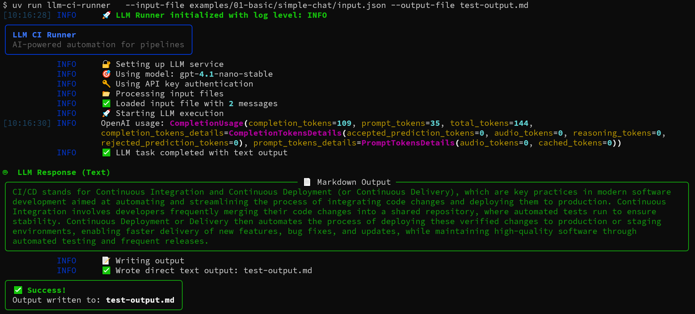

# Simple Chat Example

A basic example demonstrating text-only LLM interaction without structured output.

## Files
- `input.json` - The prompt and messages
- `README.md` - This documentation

## Usage
```bash
uv run llm_runner.py \
  --input-file examples/01-basic/simple-chat/input.json \
  --output-file result.json \
  --log-level INFO
```



## What This Demonstrates
- Basic text-only LLM interaction
- Simple system and user message structure
- No schema enforcement (free-form text output) 