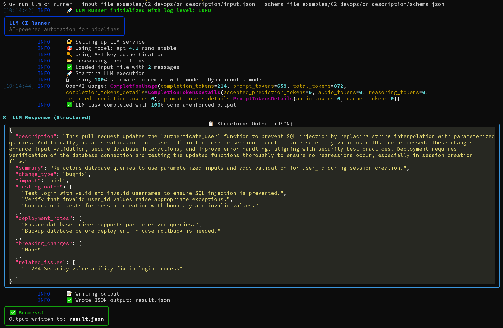

# PR Description Generation Example

Automated PR description generation with structured output for CI/CD integration.

## Files
- `input.json` - The prompt and PR context
- `schema.json` - JSON schema for structured PR descriptions
- `README.md` - This documentation

## Usage
```bash
uv run llm_runner.py \
  --input-file examples/02-devops/pr-description/input.json \
  --output-file pr-description.json \
  --schema-file examples/02-devops/pr-description/schema.json \
  --log-level INFO
```



## What This Demonstrates
- Automated PR description generation from code changes
- Structured output with comprehensive PR metadata
- CI/CD integration ready
- Impact assessment and testing requirements
- Breaking changes detection

## Schema Features
- **Change Type Classification**: Feature, bugfix, refactor, etc.
- **Impact Assessment**: Low, medium, high, critical
- **Testing Requirements**: Structured testing notes
- **Deployment Considerations**: Automated deployment notes
- **Breaking Changes**: Explicit breaking change detection 