# Semantic Kernel Simple Question Template

This example demonstrates a basic Semantic Kernel YAML template that asks questions with customizable roles.

## Files

- `template.yaml` - Semantic Kernel YAML template with embedded execution settings
- `template-vars.yaml` - External template variables file

## Key Features

- **Simple Variable Substitution**: Uses `{{$role}}` and `{{$question}}` syntax
- **Default Values**: The `role` parameter has a default value of "technical"
- **Required Variables**: The `question` parameter is marked as required
- **Embedded Settings**: Temperature and token limits defined in template
- **No External Schema**: SK YAML templates embed their own schema

## How It Works

```mermaid
graph LR
    A[📦 template.yaml<br/>• Template<br/>• Schema<br/>• Model Settings] --> C[✨ Rendered Prompt]
    B[⚙️ template-vars.yaml] --> C
    C --> D[🤖 LLM Processing]
    D --> E[📋 Structured Output]
    
    style A stroke:#01579b,stroke-width:2px
    style E stroke:#4a148c,stroke-width:2px
```



*Semantic Kernel templates are self-contained - combining prompt template, schema, and model configuration in a single YAML file.*

## Usage

```bash
# Run with template variables
uv run python -m llm_ci_runner \
  --template-file examples/05-templates/sem-ker-simple-question/template.yaml \
  --template-vars examples/05-templates/sem-ker-simple-question/template-vars.yaml \
  --output-file result.json

# Run with inline variables (not recommended for complex content)
uv run python -m llm_ci_runner \
  --template-file examples/05-templates/sem-ker-simple-question/template.yaml \
  --output-file result.json
```

## Template Structure

The Semantic Kernel YAML template includes:
- **name**: Human-readable template name
- **description**: Template purpose and usage
- **template_format**: Set to "semantic-kernel" for SK syntax
- **template**: The actual prompt template with `{{$variable}}` placeholders
- **input_variables**: Variable definitions with defaults and requirements
- **execution_settings**: Azure OpenAI configuration (temperature, tokens, etc.)

## Integration Testing

This example is automatically discovered by acceptance tests and used for integration testing of SK YAML template functionality.
